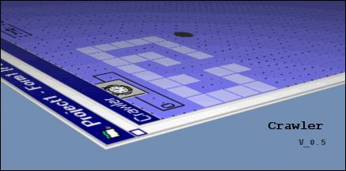

<div align="center">

## Crawler


</div>

### Description

Crawler created by Michael Dawson and Kris Bennett..

A simple game where you are against the clock! - Please vote and leave comments... Now supports warping (step off one side of the map and onto the other)!
 
### More Info
 


<span>             |<span>
---                |---
**Submitted On**   |2002-05-25 09:05:28
**By**             |[Kris Bennett \(i00 Productions\)](https://github.com/Planet-Source-Code/PSCIndex/blob/master/ByAuthor/kris-bennett-i00-productions.md)
**Level**          |Intermediate
**User Rating**    |3.8 (30 globes from 8 users)
**Compatibility**  |VB 4\.0 \(32\-bit\), VB 5\.0, VB 6\.0
**Category**       |[Games](https://github.com/Planet-Source-Code/PSCIndex/blob/master/ByCategory/games__1-38.md)
**World**          |[Visual Basic](https://github.com/Planet-Source-Code/PSCIndex/blob/master/ByWorld/visual-basic.md)
**Archive File**   |[Crawler866815242002\.zip](https://github.com/Planet-Source-Code/kris-bennett-i00-productions-crawler__1-35050/archive/master.zip)

### API Declarations

```
Private Declare Function PlaySound Lib "winmm.dll" Alias "PlaySoundA" (ByVal lpszName As String, ByVal hModule As Long, ByVal dwFlags As Long) As Long
```


